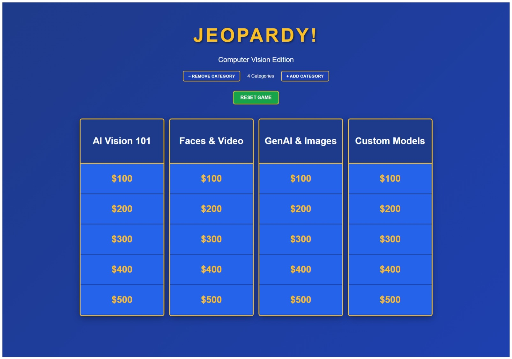

# Jeopardy Game - React Edition

A customizable Jeopardy-style game built with React, featuring dynamic category management and modular question sets.

## 📸 Game Preview



*The game features a classic Jeopardy-style board with 6 customizable categories and 5 dollar values per category. Click any amount to reveal the question!*

## 🎮 Features

- **Dynamic Categories**: Add/remove categories (1-6 columns) to match the TV show format
- **Modular Questions**: Easy-to-replace question sets with validation utilities
- **Responsive Design**: Adapts to different screen sizes and category counts
- **Game Controls**: Reset game, reveal answers, track completed clues
- **Educational Content**: Demo questions based on Microsoft Azure AI training materials

## 🚀 Quick Start

### Prerequisites
- Node.js (version 14 or higher)
- npm (comes with Node.js)

### Installation

1. Clone the repository:
```bash
git clone <your-repo-url>
cd jeopardy-generator
```

2. Install dependencies:
```bash
npm install
```

3. Start the development server:
```bash
npm start
```

4. Open [http://localhost:3000](http://localhost:3000) to view the game in your browser.

## 🎯 How to Play

1. **Select Categories**: Use the +/- buttons to adjust the number of visible categories (1-6)
2. **Choose a Clue**: Click on any dollar amount to reveal the question
3. **Reveal Answer**: Click "REVEAL ANSWER" to see the correct response
4. **Continue Playing**: Close the modal to mark the clue as completed
5. **Reset Game**: Use the "RESET GAME" button to start over

## 📝 Creating Custom Questions

The game supports easy customization of questions and categories. See the [Question Management Guide](src/data/README.md) for detailed instructions.

### Quick Overview (Use Copilot to handle question building):
1. Save a copy of the `src/data/questionTemplate.js`file in the directory folder 
2. Open the file, select all and copy the code and paste in Copilot with the prompt, "Create jeopardy-style questions based on the following URLs (*type your favorite URL content here*) and format them according to the this template"
3. Replace the file contents with your categories and questions
4. Update the import statement in `src/JeopardyBoard.js` to use your new file


### Quick Overview (Manually create questions):
1. Copy `src/data/questionTemplate.js` to create your own question set
2. Replace the placeholder text with your categories and questions
3. Update the import in `src/JeopardyBoard.js` to use your new file
4. Questions should be statements (Jeopardy-style clues)
5. Answers should start with "What is..." or "What are..."

## 📁 Project Structure

```
src/
├── JeopardyBoard.js          # Main game component
├── App.js                    # App wrapper
├── data/
│   ├── questionTemplateCV.js # Current question set (Azure AI themed)
│   ├── questionTemplate.js   # Blank template for custom questions
│   └── README.md            # Detailed question management guide
└── utils/
    └── jeopardyUtils.js     # Validation and parsing utilities
```

## 🎓 Demo Content

The included question set features 6 categories of Azure AI content based on Microsoft Learn Course AI-102T00-A: Develop AI solutions in Azure ([Course Materials](https://aka.ms/courseai-102)):

1. **AI Vision 101** - Basic computer vision concepts
2. **Faces & Video** - Face detection and video analysis  
3. **GenAI & Images** - Multimodal AI and image generation
4. **Custom Models** - Custom Vision training and deployment
5. **Document AI** - Document Intelligence and OCR
6. **AI Search** - Azure AI Search and enrichment

## 🛠️ Available Scripts

- `npm start` - Runs the app in development mode
- `npm test` - Launches the test runner
- `npm run build` - Builds the app for production
- `npm run eject` - **Note: this is a one-way operation!**

## 🎨 Customization

### Styling
The game uses inline styles for simplicity and to avoid CSS compilation issues. All styles are defined in `JeopardyBoard.js` and can be easily modified.

### Game Logic
- Category management: Handled by `visibleCategories` state
- Answer tracking: Managed by `answeredClues` Set
- Modal system: Controls question/answer display

## 📋 Requirements

- Node.js 14+
- Modern web browser with JavaScript enabled
- No additional dependencies beyond those in `package.json`

## 🤝 Contributing

1. Fork the repository
2. Create your feature branch (`git checkout -b feature/AmazingFeature`)
3. Commit your changes (`git commit -m 'Add some AmazingFeature'`)
4. Push to the branch (`git push origin feature/AmazingFeature`)
5. Open a Pull Request

## 📄 License

This project is open source and available under the [MIT License](LICENSE).

## 🎪 Built With

- [React](https://reactjs.org/) - UI framework
- [React Scripts](https://github.com/facebook/create-react-app) - Build toolchain
- Vanilla CSS (inline styles) - Styling
- JavaScript ES6+ - Game logic

## 📞 Support

For questions about creating custom question sets, see the [Question Management Guide](src/data/README.md).

For technical issues, please open an issue in the GitHub repository.
